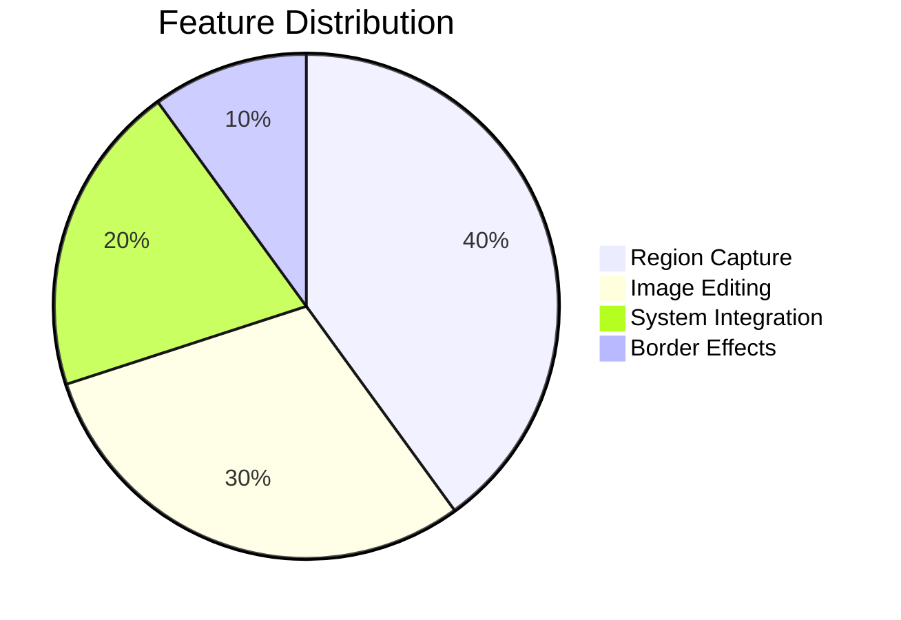
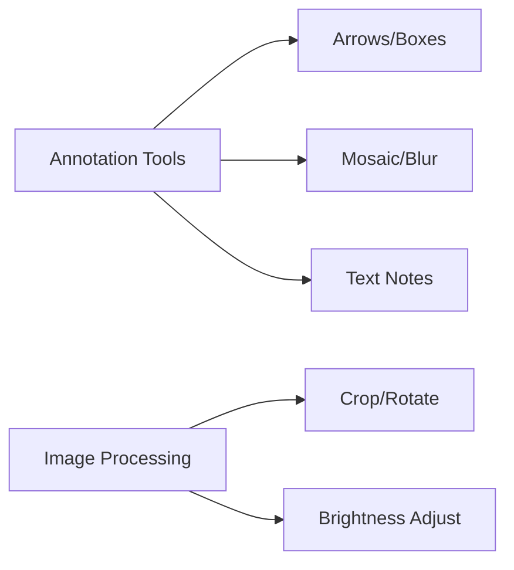
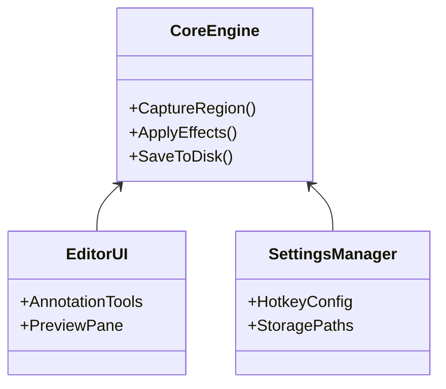

# FastScreeny - Quick Screenshot Tool

## 🖥️ Overview
FastScreeny is a lightweight Windows screenshot tool designed for **fast capture, efficient editing, and smart output**. Core philosophy: **hotkey-driven, distraction-free, productivity-first**.

## 🌟 Core Features

### 1. Smart Capture
- **Multi-Monitor Support**: Seamless cross-screen selection
- **Three Capture Modes**:
  - Fullscreen (auto-detect primary display)
  - Window (smart app window detection)
  - Freeform (pixel-level adjustment)

### 2. Instant Editor

### 3. Output Management
- **Saving Strategies**:
  - Auto-sort by date
  - Custom filename templates (time variables supported)
- **Multi-Destination Output**:
  - Local PNG (lossless quality)
  - Clipboard (instant paste)
  - Printer (one-click printing)

## ⚡ Tech Stack

## 📦 System Requirements
| Component | Specification |
|-----------|---------------|
| OS | Windows 10+ |
| Runtime | .NET 8 Desktop |
| RAM | Min 500MB free |
| GPU | DirectX 10+ support |

> Note: This documentation corresponds to v1.0 initial release. Updates will be maintained in `docs/update_info.md`