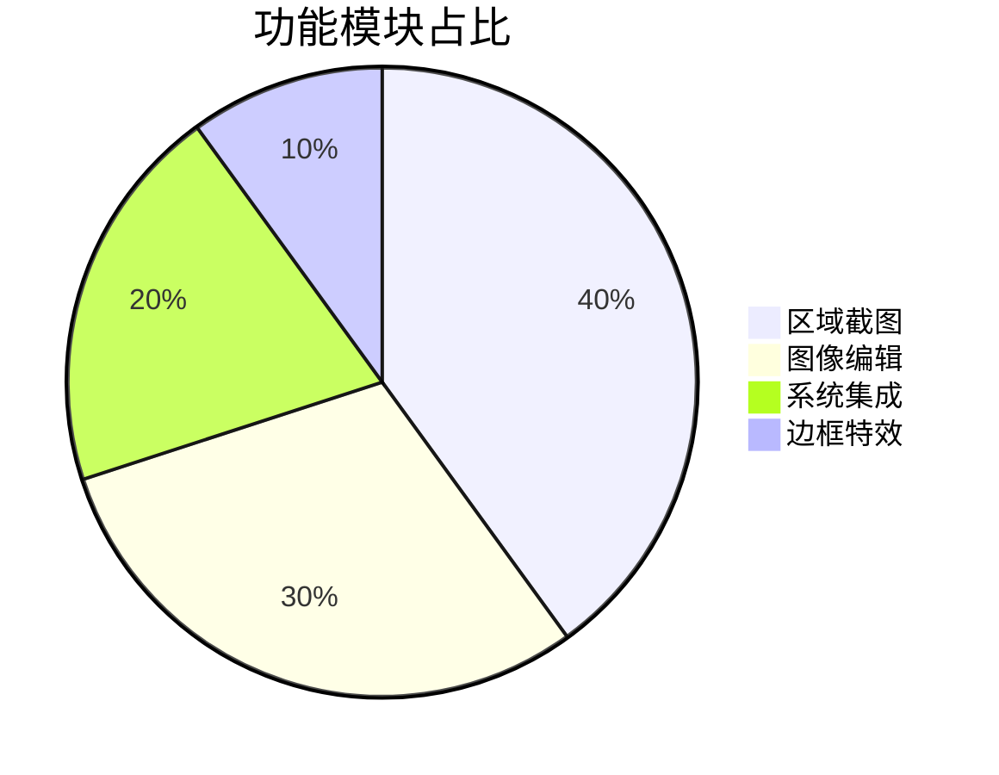
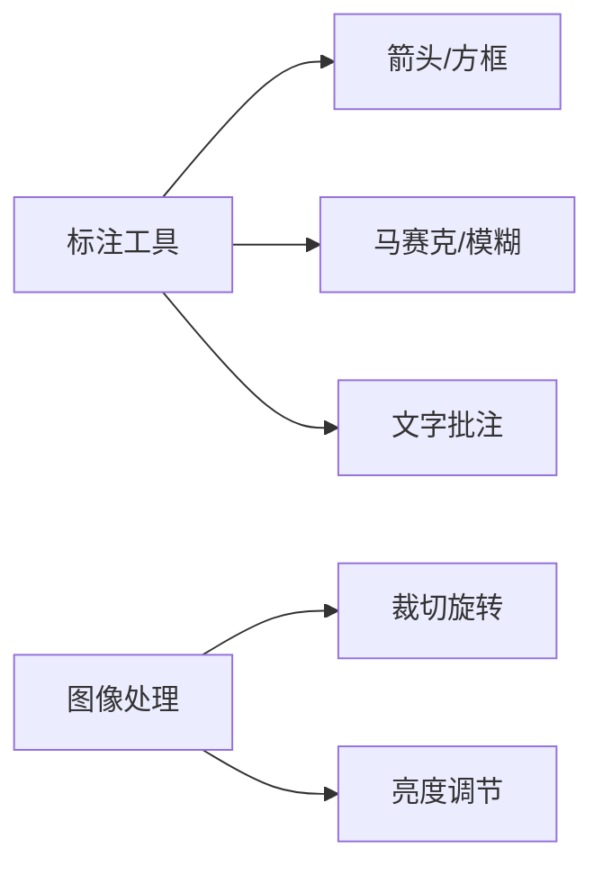
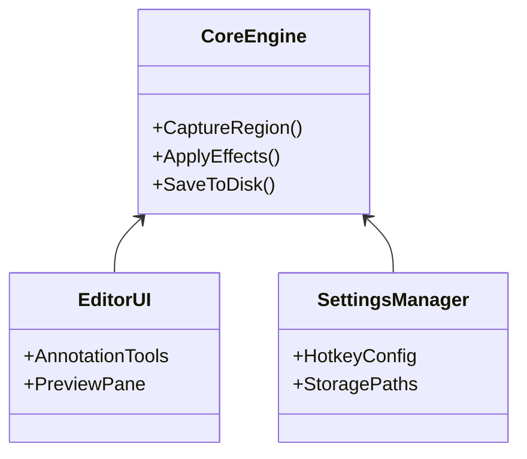

# FastScreeny 应用说明

## 🖥️ 应用概述
FastScreeny 是一款面向Windows平台的轻量级屏幕截图工具，专注于提供**快速捕获-高效编辑-智能输出**的一体化工作流。核心设计理念是：**快捷键触发、无干扰操作、生产力优先**。

## 🌟 核心能力

### 1. 智能截图
- **多显示器支持**：跨屏无缝选区
- **三种捕获模式**：
  - 全屏截图（自动识别主显示器）
  - 窗口截图（智能识别应用窗口）
  - 自由选区（支持像素级调整）

### 2. 极速编辑器

### 3. 输出管理
- **保存策略**：
  - 自动按日期分类存储
  - 自定义文件名模板（支持时间变量）
- **多目标输出**：
  - 本地PNG（无损质量）
  - 剪贴板（即时粘贴）
  - 打印机（一键打印）

## ⚡ 技术架构

## 📦 部署要求
| 组件 | 规格 |
|------|------|
| 操作系统 | Windows 10+ |
| 运行时 | .NET 8 Desktop |
| 内存 | 最低500MB空闲 |
| 显卡 | 支持DirectX 10+ |

> 注：本说明对应v1.0初始版本，后续更新将同步维护在`docs/update_info.md`